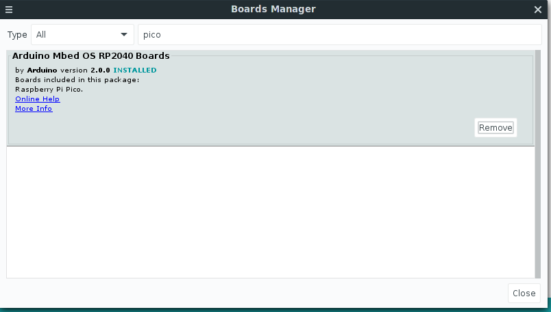
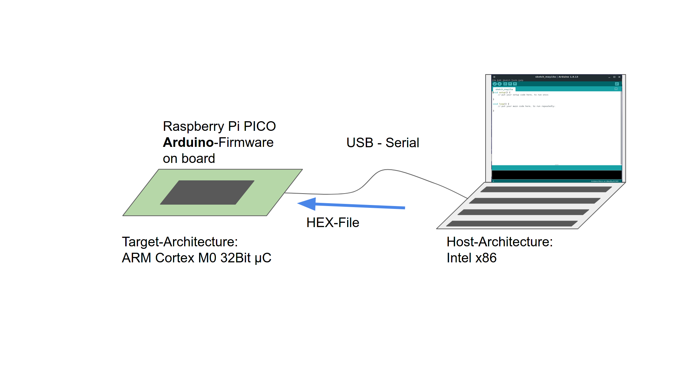

## Micro-Controllers Part IV 

---

### by Jogi 

---

* Recap last two micro-controller talks
* Show the different envs for Pico
* Compare onboarding 
* compare results
* Know your platform
* New : WLAN and BLE 

---

### Short recap 

* complicated setup with a lot of tools
* Arduino enters the world => all in one
* Raspberry Pi Pico => Python

Todo : Fetch Slides from part 1

---

### 2021 Raspberry Pi Pico enters the world

---

### Raspberry Pi Pico

* just another Micro-Controller 
* But 3 interesting aspects
    * is from the Raspberry-PI foundation => might attract new "customers"
    * breaks with the "Has to run with Arduino-IDE"-Dogma 
    * Has at least one interesting HW-Block, the PIO

---

### Raspberry Pi Pico

* always starts as UF2-Board
* looks like a USB-Stick
* Microsoft-defined USB-Format
* especially dedicated for downloading firmware to MC via USB
* Cannot put just e.g. python-Files on it

---

### The PICO itself

---

### The PINs of PICO

---

### The Blocks of PICO

---

### Raspi Pico Dev Environements

* Plain SDK (Assembler/C/C++)
* Micropython
* Circuitpython
* Arduino-IDE

---

### PICO as U2F-USB Mass-Storage

---

### Dev-Environment : SDK 

---

### Dev-Environement : SDK (cmake)

---

### Python 

* Micro-Python
* Circuit Python

---

### Micro-Python

* Attempt to put Python on Micro-Controller-Boards
* Started with an own Board
* Interpreter now available for a lot of µC-Boards
* Including the Raspberry-Pi Pico

---

### Dev-Env Micro-Python

---

### Circuit-Python

* Is a fork of Micro-Python
* Done/maintained by Adafruit
* A lot of differences in the libraries
* Main difference visible : Provides a "real" USB-Drive

---

### Dev-Env Circuit-Python

---

### Arduino for the PICO

* was not in the focus of Raspberry-Pi organisation
* started as community-project
* since end of April 2021 : officially supported

---

### Installation via Board-Library

---

### Dev-Environement : Arduino

### Micro-Python : official 

#### Setup Part 1

* Download Micropython U2F (with or w/o WLAN)
* press BOOTSEL - Button
* connect USB
* A USB-Stick appears
* copy U2F to USB-Stick
* done

---

### Micro-Python : official 

#### Setup Part 2

* Download Thonny 
* Install Thonny
* (contains already serial tty-connection to Pico)
* done

---

### Micro-Python : official 

#### Start working 

* Thonny == your IDE
* Connect to Pico 
* Open file local or from pico
* Run

---

### Setup from Raspi-foundation

---

### Micro Python

####  Internal LED (Pin25)

<pre><code data-line-numbers="2|4|6-8">
import machine

led_onboard = machine.Pin(25, machine.Pin.OUT)

while True:
    led_onboard.value(1)
    led_onboard.value(0)

</pre></code>

---

### Micro Python 

#### External red LED (Pin15)

<pre><code data-line-numbers="2|4|6-8">
import machine

red_light = machine.Pin(15, machine.Pin.OUT)

while True:
    red_light.value(1)
    red_light.value(0)

</pre></code>

---

### Circuit Python 

#### Internal LED (Pin25)

<pre><code data-line-numbers="2-4|6-7|9-12">
import board
import digitalio
import time

led = digitalio.DigitalInOut(board.LED)
led.direction = digitalio.Direction.OUTPUT

while True:
    led.value = True
    time.sleep(0.5)
    led.value = False
    time.sleep(0.5)

</pre></code>

---

### Demo-Time 1

[https://makecode.microbit.org/#editor](https://makecode.microbit.org/#editor)

---

### What we (hopefully) saw

---

### The PIO

* Programmable IO
* "a Co-Processor", dedicated to programm even new serial "buses"
* offloads work from the CPU, compared to "bit-banging"
* https://www.cnx-software.com/2021/01/27/a-closer-look-at-raspberry-pi-rp2040-programmable-ios-pio/

---

### Conclusion for PICO

4 Different Dev-Environments

* C/C++ - SDK via cmake and U2F-Filesystem
* Micro-Python with USB-serial / Thonny
* Circuit-Python with real filesystem
* Arduino - IDE 

Choose yourself

---

### Resources 

* this talk [git-repo (branch gh_pages)](https://github.com/jogi-k/micro-controllers-part4/tree/gh-pages)
* Micropython for Raspberry Pi Pico: [Info](https://www.raspberrypi.com/documentation/microcontrollers/micropython.html) and the [U2F-Image](https://micropython.org/download/rp2-pico/rp2-pico-latest.uf2)
* Circuitpython for Raspberry Pi Pico: [Info](https://circuitpython.org/board/raspberry_pi_pico/) and the  [U2F-Image](https://downloads.circuitpython.org/bin/raspberry_pi_pico/en_US/adafruit-circuitpython-raspberry_pi_pico-en_US-8.0.4.uf2)
* C/C++ - SDK for Raspberry Pi Pico: [Info](https://www.raspberrypi.com/documentation/microcontrollers/c_sdk.html) and the [GIT-Repository](https://github.com/raspberrypi/pico-sdk)

---

### Legal stuff

* 

---

### The END 

