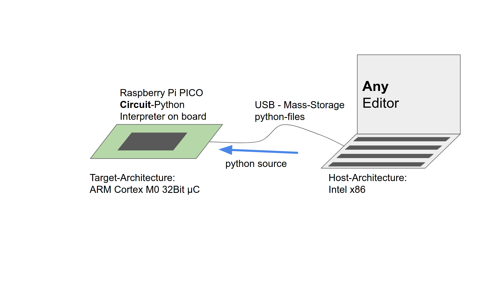
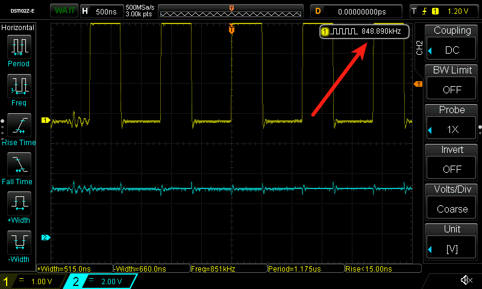
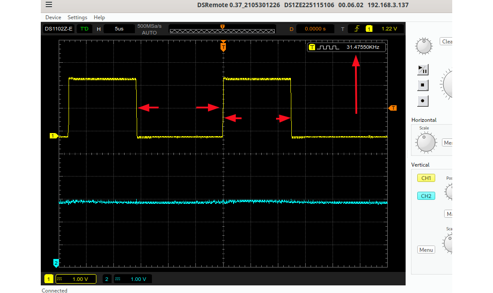

## Micro-Controllers Part IV 

---

### by Jogi 

---

## Microcontroller Talks

1. Introduction, history incl 6502, 80C166, via Arduino to Raspi Pico, Jogi, [Code](https://github.com/jogi-k/micro-controller-slides/tree/gh-pages) and [Slides](https://jogi-k.github.io/micro-controller-slides) 
2. MC-based learning-platforms, Micro:Bit & Calliope, Jogi, [Code](https://github.com/jogi-k/micro-controllers-part2/tree/gh-pages) and [Slides](https://jogi-k.github.io/micro-controllers-part2)
3. ESP8266- and EPS32-Universe, [Felix](https://github.com/fliiiix), Lightning Talks-Repo 
4. **This** : More Pi Pico, Environments, Comparison, Eco-System, Jogi, [Code](https://github.com/jogi-k/micro-controllers-part4) and [Slides](https://jogi-k.github.io/micro-controllers-part4)
5. (unplanned) internal usecase RLX-Testfarm, making use of [RubberJogi OS](https://github.com/jogi-k/RubberJogi), Lightning Talks Repo

---

* Recap first micro-controller talk
* Show the different envs for Pico
* Compare onboarding 
* compare results
* Some infos ECO-System 
* New : WLAN and BLE 

---

### Short recap 

* Complicated setup with a lot of tools
* Arduino enters the world => all in one
* Raspberry Pi Pico => Python

---

### Programming Environment

---

####  Steps needed 

<pre><code data-line-numbers="2|4-6|8|10|12|14">
Edit Code 

Call C-Compiler (C ==> Assembler) 

Call Assembler  (Assembler ==> Binary)

Call Linker (several Modules ==> one Executable)

Call Locator (knows Memory-Layout)

Call HEX-converter (Flash-Format)

Send via Serial line to Target-Board

</pre></code>

---

### "THE" innovation : From 

---

### To "Arduino: All in one"
 

---

### The IDE

---

### Arduino-Compatibility

* From 2008 till
* 2021 
* Micro-Controller for "everyone"
* "needed" to be Arduino-compatible

---

### 2021 Raspberry Pi Pico enters the world

---

### Raspberry Pi Pico

* just another Micro-Controller 
* But 3 interesting aspects
    * is from the Raspberry-PI foundation => might attract new "customers"
    * breaks with the "Has to run with Arduino-IDE"-Dogma 
    * Has at least one interesting HW-Block, the PIO

---

### Raspberry Pi Pico

* always starts as UF2-Board
* looks like a USB-Stick
* Microsoft-defined USB-Format
* especially dedicated for downloading firmware to MC via USB
* Cannot put just e.g. python-Files on it

---

### The PICO itself

---

### The PINs of PICO

---

### The Blocks of PICO

---

### Raspi Pico Dev Environements

* Plain SDK (Assembler/C/C++)
* Micropython
* Circuitpython
* Arduino-IDE
* MMBasic

---

### PICO as U2F-USB Mass-Storage

---

### Dev-Environment : SDK 

---

### Dev-Environement : SDK (cmake)

---

### Python 

* Micro-Python
* Circuit Python

---

### Micro-Python

* Attempt to put Python on Micro-Controller-Boards
* Started with an own Board
* Interpreter now available for a lot of Micro-C-Boards
* Including the Raspberry-Pi Pico

---

### Dev-Env Micro-Python

---

### Circuit-Python

* Is a fork of Micro-Python
* Done/maintained by Adafruit
* A lot of differences in the libraries
* Main difference visible : Provides a "real" *USB-Drive*
* Can be used with *any* editor
* mu-editor is preffered, offers some capabilities

---

### Dev-Env Circuit-Python

---

### Micro-Python : official 

#### Setup Part 1

* Download Micropython U2F (with or w/o WLAN)
* press BOOTSEL - Button
* connect USB
* A USB-Stick appears
* copy U2F to USB-Stick
* done

---

### Micro-Python : official 

#### Setup Part 2

* Download Thonny 
* Install Thonny
* (contains already serial tty-connection to Pico)
* done

---

### Micro-Python : official 

#### Start working 

* Thonny == your IDE
* Connect to Pico 
* Open file local or from pico
* Run

---

### Setup from Raspi-foundation

---

### Micro Python

####  Internal LED (Pin25)

<pre><code data-line-numbers="2|4|6-8">
import machine

led_onboard = machine.Pin(25, machine.Pin.OUT)

while True:
    led_onboard.value(1)
    led_onboard.value(0)

</pre></code>

---

### Micro Python 

#### External red LED (Pin15)

<pre><code data-line-numbers="2|4|6-8">
import machine

red_light = machine.Pin(15, machine.Pin.OUT)

while True:
    red_light.value(1)
    red_light.value(0)

</pre></code>

---

### Circuit Python 

#### Internal LED (Pin25)

<pre><code data-line-numbers="2-4|6-7|9-12">
import board
import digitalio
import time

led = digitalio.DigitalInOut(board.LED)
led.direction = digitalio.Direction.OUTPUT

while True:
    led.value = True
    time.sleep(0.5)
    led.value = False
    time.sleep(0.5)

</pre></code>

---

### Differences 

* Libs completely differ
* Support for Hardware
* USB-appearance
* Autostart:
    * main.py Micropython
    * code.py Circuitpython
* Micropython is "official"

---

### Demo-Time 

Note:
OSZI dsremote
mypthon: main.py
cpython: code.py
Basic: screen /dev/ttyACM 38400
Ctrl C zum Abbrechen
Ctrl A k zum Verlassen von Screen

---

### What we (hopefully) saw

---

### Speed Micropython

---

### Startup Miropython

---

### Speed Circuitpython

---

### Startup Circuitpython

---

### Speed Arduino 

---

### Startup Arduino 

---

### Speed SDK 

---

### Startup SDK 

---

### Speed MMBasic

---

### Startup MMBasic

---

### Summary

|                | Getting started | Execution Speed |  Startup Delay |
|----------------|-----------------|-----------------|----------------|
| MMBasic  	     | Okay    	       |     30 kHz      |  3000 ms	      |
| Micro-Python   | Easy        	   |     74 kHz    	 |   100 ms       |
| Circuit Python | even more easy  |     90 kHz      |  1200 ms       |
| Arduino  	     | Easy/Okay       |    850 kHz      |   150 ms       |
| SDK  	         | Most effort     | 30 000 kHz      |    20 ms	      |

---

### Speed an issue ?

[Video](./pics/IMG_0149.mp4)

---

### The PIO

* Programmable IO
* "a Co-Processor", dedicated to programm even new serial "buses"
* offloads work from the CPU, compared to "bit-banging"
* https://www.cnx-software.com/2021/01/27/a-closer-look-at-raspberry-pi-rp2040-programmable-ios-pio/

Unfortunately : Did not make it into this talk ...

---

### 2022 : Pico with WiFi

---

### Easy Webserver 

* Serve Web-Pages
* Control LEDs
* Starting with PicoZero, even more simple

---

### Demo 2

---

### Additional HW

* ePaper ==> Python
* Round LCD w Gyroscope ==> Python 
* Grove Breakout Board ==> Python 
* Small LCD with Key ==> Mandelbrot ! ==> SDK

---

### Demo 3

---

### Conclusion for PICO

5 Different Dev-Environments

* C/C++ - SDK via cmake and U2F-Filesystem
* Micro-Python with USB-serial / Thonny
* Circuit-Python with real filesystem
* Arduino - IDE 
* MMBasic  

Know the limits and choose yourself

---

### Resources 

* this talk [git-repo (branch gh_pages)](https://github.com/jogi-k/micro-controllers-part4/tree/gh-pages)
* Micropython for Raspberry Pi Pico: [Info](https://www.raspberrypi.com/documentation/microcontrollers/micropython.html) and the [U2F-Image](https://micropython.org/download/rp2-pico/rp2-pico-latest.uf2)
* Circuitpython for Raspberry Pi Pico: [Info](https://circuitpython.org/board/raspberry_pi_pico/) and the  [U2F-Image](https://downloads.circuitpython.org/bin/raspberry_pi_pico/en_US/adafruit-circuitpython-raspberry_pi_pico-en_US-8.0.4.uf2)
* C/C++ - SDK for Raspberry Pi Pico: [Info](https://www.raspberrypi.com/documentation/microcontrollers/c_sdk.html) and the [GIT-Repository](https://github.com/raspberrypi/pico-sdk)
* https://www.heise.de/ratgeber/Programmieren-mit-dem-Raspberry-Pi-Pico-Back-to-BASIC-7461038.html
* https://hackspace.raspberrypi.com/issues/52/pdf/download

---

### Meetup Zuerich

Every first monday in the month in Zuerich : [here](https://www.meetup.com/arduino-und-elektronik-abend-im-fablab-zurich)

---

### Meetup Brunnen 

every four weeks , wednesday or thursday in Brunnen : [here](https://www.meetup.com/de-DE/arduino-raspberry-pi-und-mehr-innerschwyz/) 

---

### The END 

